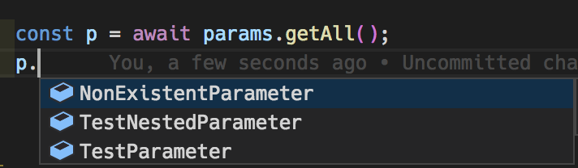
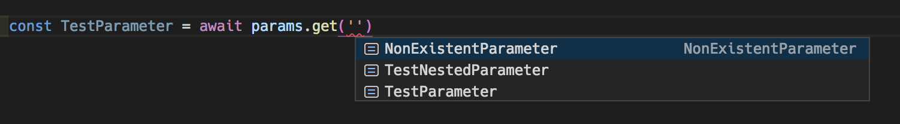

# `SSMParameterStore`

Ergonomic SSM Parameter Store wrapper for AWS Lambda designed with ease-of-use in mind, with built-in caching and idempotent preloading, TypeScript compile time checks, and handy autocompletion.

https://www.npmjs.com/package/ssm-parameter-store

## Installation

`npm install --save ssm-parameter-store`

## Usage

```js
const SSMParameterStore = require('ssm-parameter-store');

const parameters = new SSMParameterStore({
  SomeParameter: 'some_parameter',
  SomeNestedParameter: '/some/nested/parameter',
  NonExistentParameter: 'this_parameter_doesnt_exist_on_ssm'
});

exports.handler = async (event, context) => {
  await parameters.preload();
  // Fetch and cache all the parameter values from SSM.
  // The cache persists across warm start Lambda invocations, so subsequent
  // calls to preload will resolve instantly, making it safe to call every time
  // in the Lambda handler.

  await params.getAll();
  // Returns all the parameters as an object. Since we already fetched and cached
  // the values when we called `preload` this resolves instantly. If `preload` wasn't
  // called then we fetch the parameter values from SSM and cache them before returning
  // them as an object. Parameters that don't exist on SSM have empty strings as their values.
  //
  // {
  //   SomeParameter: '1',
  //   SomeNestedParameter: 'Hello, World!',
  //   NonExistentParameter: ''
  // }

  await parameters.preload({ ignoreCache: true });
  // Clear the cache and preload everything again from SSM

  await parameters.get('SomeParameter'));
  // Get a specific parameter value from SSM and return it
  // Caches it in case it hasn't been cached before.
  // If the parameter doesn't exist on SSM it returns an empty string.

  await parameters.get('SomeParameter', { ignoreCache: true });
  // Fetches this parameter value from SSM again and returns it ignoring any cached values.
  // The newly fetched value is cached before returning.
  // If the parameter doesn't exist on SSM it returns an empty string.

  await parameters.get('UndeclaredParameter');
  // Throws an error because this wasn't declared in the object passed to the
  // `new SSMParameterStore()` constructor.
  // If you're using TypeScript you'll also get a compile time error
}
```

## Autocompletion



